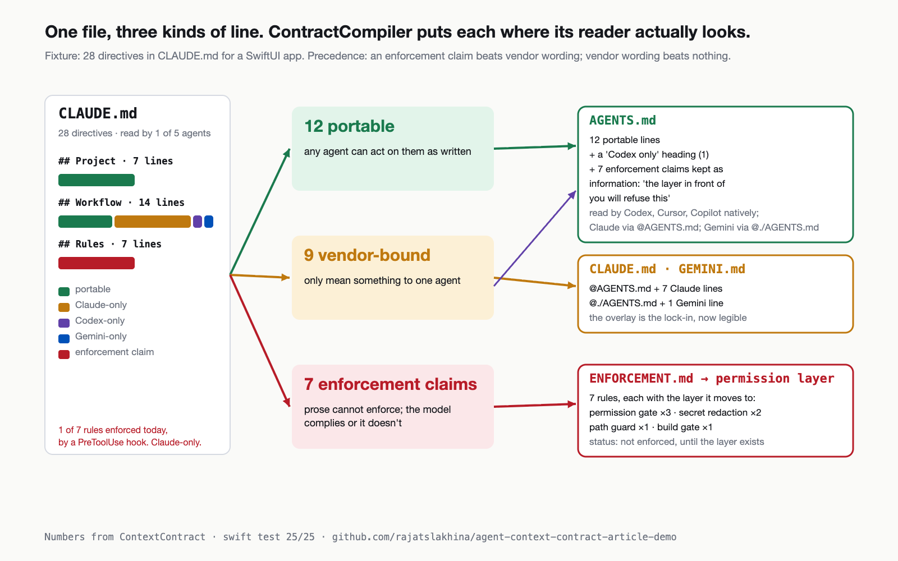

# ContextContract — the CLAUDE.md scanner for the day Xcode makes your coding agent a dropdown

A small, tested Swift library that reads an agent instructions file (`CLAUDE.md`, `AGENTS.md`,
`GEMINI.md`, anything markdown) and sorts every directive into the three things such a file is
always made of: lines any agent can act on, lines written for one vendor, and lines that *claim*
to enforce something prose cannot enforce. Then it compiles the file into a vendor-neutral
contract plus per-vendor overlays plus an enforcement plan, and reports which agents can read
each version.

Article: [Xcode 27 Made Your Coding Agent a Dropdown. I Scanned a CLAUDE.md: 0 of 28 Lines Reach the Next Agent.](https://medium.com/@er.rajatlakhina/xcode-27-made-your-coding-agent-a-dropdown-a1f020e8346b) (Medium)



## Why

Xcode 27 (release candidate, 9 September 2026) ships *Settings ▸ Intelligence ▸ Add an Agent…*, first seen in the June betas:
any binary that speaks the [Agent Client Protocol](https://agentclientprotocol.com) runs inside
Xcode as a subprocess, next to the Claude, Codex and Gemini agents Apple wired in itself. ACP's
`session/new` carries the editor's MCP server list, so tool servers follow you across agents.
It carries no instructions file. Each agent reads its own from the working directory —
Claude Code reads `CLAUDE.md`, Codex reads `AGENTS.md`, Gemini CLI reads `GEMINI.md` — so the
day someone picks a different item in that dropdown, the file you wrote is not read at all.

## What it shows

- `Vendor` — Claude Code, Codex, Gemini CLI, Cursor, GitHub Copilot: the file each reads natively
  and what it takes to make it read `AGENTS.md` (`reads(_:)` → `.native` / `.viaImport(how)` / `nil`).
- `VendorSignature` — conservative evidence per vendor: product names (proper nouns only), vendor-owned
  paths (`.claude/`, `GEMINI.md`, `.cursor/rules`), the vendor's tool names (`MultiEdit`, `apply_patch`,
  `run_shell_command`), slash commands and flags, vendor-only mechanisms (`PreToolUse`). Tool names
  that are also English words (`Read`, `Edit`, `Grep`, `Task`, `Write`) only count as `` `Read` `` or
  "the Read tool".
- `Enforcement` + `EnforcementDetector` — four kinds of claim and the vendor-neutral layer each one must
  move to: `permissionGate` (ACP `session/request_permission`), `pathGuard`, `buildGate`
  (turn-completion gate + CI), `secretRedaction`. A path guard needs a prohibition verb *and* a
  path-like token; a secret claim needs secret vocabulary *and* a prohibition or leak verb.
- `Placement.decide` — an enforcement claim beats vendor wording; vendor wording beats nothing;
  a line naming several vendors goes to the one with the most evidence, ties to declaration order.
- `ContractScanner.scan` — bullets, numbered items and paragraphs become `Directive`s with their
  `##` section and 1-based line; headings, blank lines and fenced code are skipped.
- `PortabilityReport` — counts and shares: `portableShare`, `lockInScore` (vendor-bound share),
  `enforcementByProseShare`, `dominantVendor`, and `vendorEnforced` (claims that are also worded for
  one vendor, i.e. rules that lose their teeth silently on a swap).
- `ContractCompiler.compile` — writes `AGENTS.md` (portable lines, a "Codex only" heading, the
  enforcement claims kept as *information*), `CLAUDE.md` (`@AGENTS.md` + Claude lines), `GEMINI.md`
  (`@./AGENTS.md` + Gemini lines), overlay files for Cursor/Copilot only when they have lines, and
  `ENFORCEMENT.md` (one row per claim, the layer it moves to, status *not enforced*).
- `Coverage` — how many directives reach each agent, as written vs compiled.
- `Fixture.claudeMD` — a realistic CLAUDE.md for a SwiftUI app: 28 directives across three sections
  (38 lines including headings and blanks). Every number below comes from scanning exactly this text;
  the tests pin them.
- `ContextContractDemoView` — SwiftUI: Scan (three tiles, lock-in score, every line with its badge
  and matched evidence), Files (the compiled files), Coverage (before/after per agent), and an
  editor sheet so you can paste your own file.

## Results on the fixture (pinned by tests)

| Bucket | Lines | Share | Goes to |
|---|---|---|---|
| Portable | 12 | 43% | `AGENTS.md` |
| Vendor-bound | 9 (7 Claude · 1 Codex · 1 Gemini) | 32% | overlays |
| Enforcement claims | 7 (3 permission gate · 2 secret redaction · 1 path guard · 1 build gate) | 25% | `ENFORCEMENT.md` → permission layer |

All seven lines under `## Rules` are enforcement claims. Exactly one of them is enforced today —
by a `PreToolUse` hook in `.claude/settings.json`, which is Claude-only (`vendorEnforced` = line 38).

| Agent | Reads `CLAUDE.md` as written | Reads the compiled contract |
|---|---|---|
| Claude Code | 28 (native) | 26 (`@AGENTS.md` shim) |
| Codex | 0 | 20 (native) |
| Gemini CLI | 0 | 20 (`@./AGENTS.md` shim) |
| Cursor | 0 | 19 (native) |
| GitHub Copilot | 0 | 19 (native) |

Compiled counts are the 12 portable lines + the 7 claims kept as information + that agent's own
overlay. One of five agents reads the file as written; five of five read the contract.

```swift
let report = PortabilityReport(markdown: Fixture.claudeMD)
report.total                  // 28
report.portable               // 12
report.vendorBound            // [.claude: 7, .codex: 1, .gemini: 1]
report.protocolLayer          // 7
report.vendorEnforced.map(\.line)   // [38]

let out = ContractCompiler.compile(report, project: "Ledger")
out.files.map(\.path)         // ["AGENTS.md", "CLAUDE.md", "GEMINI.md", "ENFORCEMENT.md"]
out.files[1].contents.hasPrefix("@AGENTS.md\n")   // true

Coverage(report: report, sourceFile: "CLAUDE.md").agentsReadingAsWritten   // 1
Coverage(report: report, sourceFile: "CLAUDE.md").agentsReadingCompiled    // 5
```

```swift
public static func decide(_ signals: [Signal]) -> Placement {
    let kinds = Enforcement.allCases.filter { kind in signals.contains { $0.enforcement == kind } }
    if !kinds.isEmpty { return .protocolLayer(kinds) }          // a claim beats vendor wording
    var counts: [Vendor: Int] = [:]
    for s in signals { if let v = s.vendor { counts[v, default: 0] += 1 } }
    guard let best = counts.values.max(),
          let winner = Vendor.allCases.first(where: { counts[$0] == best }) else { return .portable }
    return .vendorOverlay(winner)
}
```

## What it deliberately is not

A regex triage tool, not a linter. It looks for product names, vendor-owned paths, vendor tool
names and enforcement vocabulary, and it misses things on purpose: a false negative costs one line
of review, a false positive tells a team to rewrite a line that was fine. The vendor file facts
(who reads `AGENTS.md`, how Claude Code and Gemini CLI import it) are encoded in `Vendor.reads(_:)`
and will need updating when the vendors change them — Claude Code did not read `AGENTS.md`
natively as of August 2026, hence the `@AGENTS.md` shim.

## How to run it

```bash
git clone https://github.com/rajatslakhina/agent-context-contract-article-demo.git
cd agent-context-contract-article-demo
swift test          # 25 tests (verified on Linux; macOS not exercised in this run)
open Demo.xcodeproj # pick the Demo scheme, an iPhone Simulator, Build & Run
```

No other setup: `Demo.xcodeproj` consumes the library through a local package reference to this
same folder. `make_images_2026-09-10.js` renders the four article figures in `Article/` as SVG on an HTML
canvas (that is how the committed PNGs were produced); `make_images_2026-09-10.py` is the Pillow
equivalent of the same layout, from the same numbers.

## Verification status

- `swift build`: 0 warnings, `swift test`: 25/25 on Swift 6.0.3, Linux aarch64. `DemoView.swift` is SwiftUI-only (`#if canImport(SwiftUI)`), so the Linux build covers the six non-UI files; the view was reviewed by hand and its two iOS-only calls sit behind `#if os(iOS)`.
- `Demo.xcodeproj/project.pbxproj`: hand-authored, braces 32/32, parens 24/24, 22 object ids, no dangling references; shared `Demo` scheme committed.
- **Simulator run: not completed.** This repo was produced by an unattended scheduled session in which the computer-use grant for Xcode/Simulator could not be approved, so the app was never launched and there is no screenshot (`Demo/Screenshots/README.md` says the same). `ContextContractDemoView` was reviewed by hand against the iOS 17 SwiftUI APIs it uses.

## Sources

- Jason Pickering, BuildApps — [Apple stopped picking your AI coding agent for you](https://buildapps.co.uk/signals/xcode-agent-client-protocol-any-ai-coding-agent/)
- Marc Nuri — [Agent Client Protocol (ACP): the LSP for AI coding agents](https://blog.marcnuri.com/agent-client-protocol-acp-introduction)
- Reda Lemeden — [How to use OpenCode in Xcode 27](https://redalemeden.com/derived-data/2026/how-to-use-any-harness-with-xcode-27/) (the *Add an Agent…* setting)
- ACP — [Session setup](https://agentclientprotocol.com/protocol/session-setup)
- Gemini CLI — [Memory import processor](https://github.com/google-gemini/gemini-cli/blob/main/docs/reference/memport.md) (`@./file.md` imports; the `context.fileName` setting lives in the CLI configuration reference)
- Claude Code — [Memory / CLAUDE.md imports](https://docs.claude.com/en/docs/claude-code/memory)

MIT.
